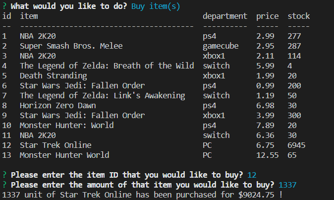

# Bamazon - CLI Shopping!

Bamazon is a CLI that allows customers to buy items from a mySQL database. 

There are three different clients available with the following menu options.

1. Customer - 

2. Manager -

3. Supervisor -

## Examples of selected options ~

1. Buy item(s) -

Using this option the user can buy products.

2. Shop by department -

Choose a department and buy items from it.

3. View Products for Sale -

View all the items for sale on Bamazon.

4. View Low Inventory -

If any product has less than 5 items in stock, they will be displayed.

5. Add to Quantity -

Allows managers and supervisors to add quantity to products stock count.

6. Add New Product -

Allows managers and supervisors to add a new products to Bamazon.

7. View Product Sales by Department -

Supervisors may view the sales for each department.

8. Create New Department -

This allows supervisors to create a new department.

9. Exit -

Select 'Exit' to exit Bamazon.

## Examples of error handling ~

* #### Not Enough Quantity error 

If there aren't enough of that product in stock this will display.

* #### Department already exists error 

Displays when a department already exists.

* #### Item not found error 

If an item doesn't exist this error will trigger.

* #### New item with new department error 

If a new item is being added, but also has a new department, the new department must be made first!

